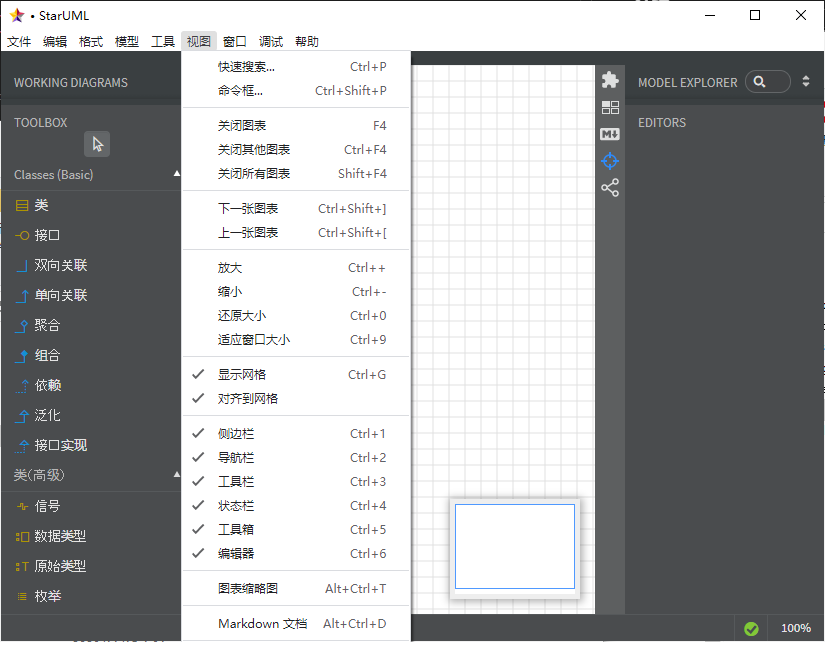
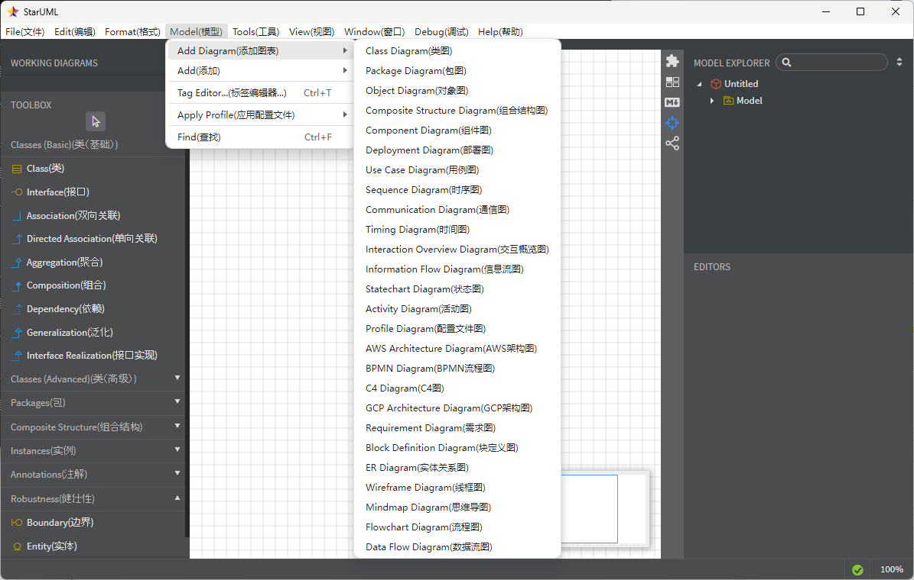

# StarUML 中文汉化版语言翻译包

## 介绍

对官方版 StarUML 程序 by [staruml.io](https://staruml.io/) ，进行了部分汉化。

可自行在本地修改翻译文本，该项目所有数据与执行脚本均为明文开源，汉化脚本没有对程序做其他修改，仅做了部分文本的翻译。




关于 StarUML 或 UML 的使用心得大家也可以在这儿一起讨论 :-）

## 完善该中文包

你发现翻译问题，或有汉化补充、更好的翻译优化，可以提交 resources/langPackage.json 文件的 git MR请求到该 github 库。

## 如何使用

### 1. 电脑中安装node.js运行环境

NodeJS [下载地址](https://nodejs.org/) 


请确保命令行中能成功执行  
```bash
node -v
```

### 2. 下载该汉化脚本的zip包

将包中的3个文件解压到 starUML 的安装目录中的 ```resources``` 目录中，要与目录中的 ```app.asar``` 文件平级。

	包含3个主要文件：

	* langPackage.json
	* package.json
	* warp.js

### 3. 执行汉化脚本

```cd``` 到程序的安装目录 ```~/starUML/resources``` 下，执行 ```npm start``` 命令行。

看见提示  “```安装中文包完成。```”，则汉化完成，直接运行 starUML 程序开始使用就是中文界面了。

## 更多特性

文件 ```langPackage.json``` 即为翻译用的文本对照包，可自行对其中各项的 "lang" 字段进行修改，实现自定义翻译

```"language-immerse": true```, 字段值改为 ```false``` 可实现双语界面。

执行`npm start`后生效。

## 其他

目前汉化包 最新测试的版本范围 Node.js v18+ & StarUML 6.0.1 ~ 6.3.2

[手把手 详细安装教程](resources/汉化文档/详细使用方法/readme.md) 

## 感谢 StarUML 

汉化包内容，任何人均可随意使用