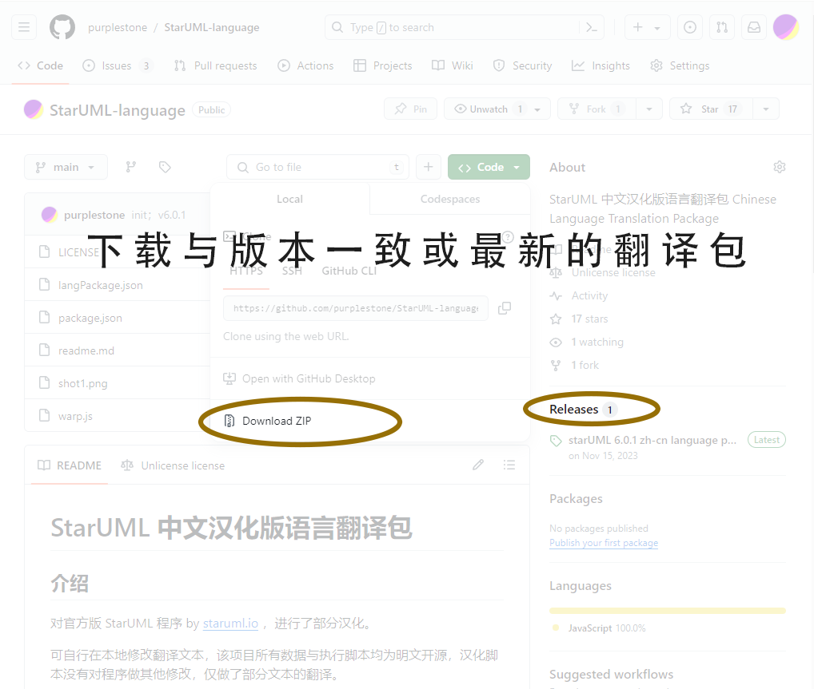
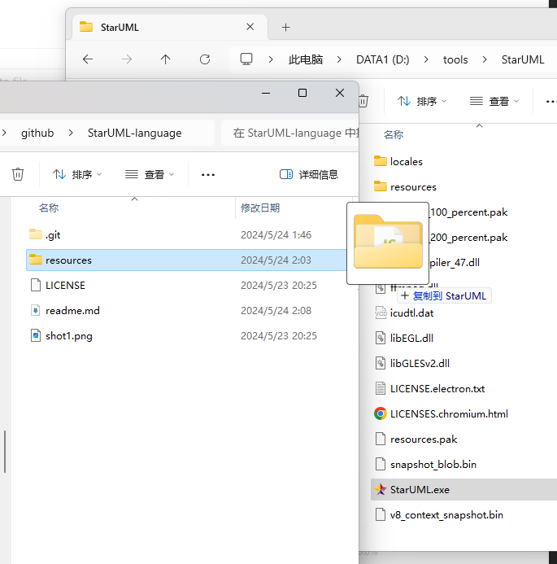
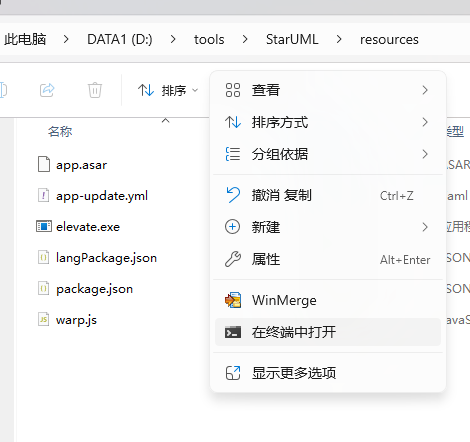
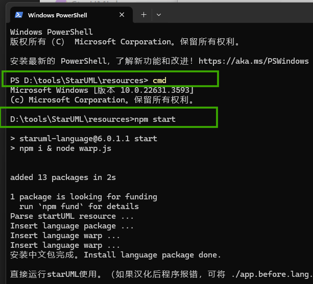
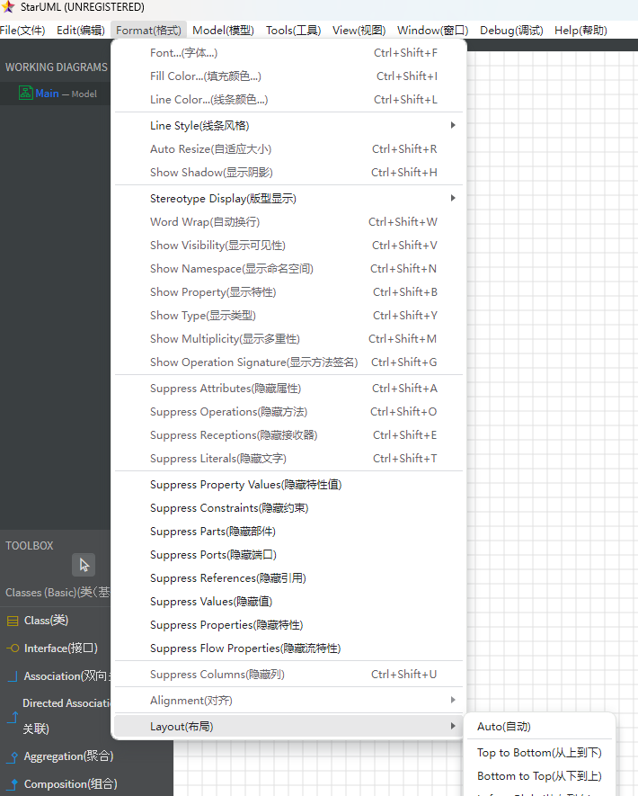

# 详细使用方法

src: https://github.com/purplestone/StarUML-language

## 1. 在电脑中安装 Node.js 运行环境

[NodeJS 下载地址](https://nodejs.org/) 

## 2. 下载该汉化脚本的zip包， 并释放文件到 StarUML 的 resources 目录中



复制语言包中的 resources 里的文件到 StarUML 的 resources 目录里

将包中的3个文件解压到 starUML 的安装目录中的 ```resources``` 目录中，要与目录中的 ```app.asar``` 文件平级。

	包含3个主要文件：

	* langPackage.json
	* package.json
	* warp.js



运行命令行到 StarUML 的 resources 目录

	（右击 StarUML/resources 目录，选择 [在终端中打开]，PS 没权限 可以执行一下 > cmd 命令）



### 3. 执行汉化脚本

```cd``` 到程序的安装目录 ```starUML/resources``` 下，执行 
```bash
npm start
``` 




看见提示  “```安装中文包完成。```”，则汉化完成，直接运行 starUML 程序开始使用就是中文界面了。

## 其他使用方法

### 自定义翻译
文件 ```langPackage.json``` 即为翻译用的文本对照包，可自行对其中各项的 `text.lang`、`description.lang` 字段值进行修改，实现自定义翻译

	你可以将没汉化到 或 没翻译好的地方，提交 langPackage.json 文件的修改到该汉化包的 github 库中，大家一起完善中文包

### 双语界面

文件 `langPackage.json` 的 ```"language-immerse": true```, 字段值改为 ```false``` 可实现双语界面。

**修改后，都是需要再执行脚本后生效。**

```bash
npm start
``` 





